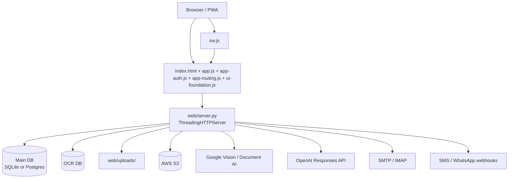

# Architecture

Leyenda:
- `Hecho`: comprobado directamente en este repositorio.
- `Inferencia`: lectura razonable a partir del código y su estructura.

## Vision general del sistema
- Hecho: el sistema es un CRM/ERP monolitico en Python con una SPA clasica en `web/`; el backend principal vive en `web/server.py` y expone una API HTTP propia con `ThreadingHTTPServer`.
- Hecho: la aplicacion cubre varios dominios de negocio que el codigo separa por rutas y helpers: CRM 360/workspaces, Gestoria, Seguros, Inmobiliaria, Financiacion/Hipotecas, Fincas, RRHH/registro horario, Facturacion/portal cliente, Legal Radar y almacenamiento S3/uploads.
- Inferencia: la arquitectura es de un monolito modularizado por capas y por dominio, no de microservicios; la separacion real se hace por modulo, por prefijos de API y por convenciones de scoping.

## Estructura de carpetas
- Hecho: en la raiz hay `.github/`, `assets/`, `tests/` y `web/`; ademas de `requirements.txt`, `requirements-dev.txt`, `pyproject.toml`, `.python-version`, `.gitignore`, `.pre-commit-config.yaml` y `AGENTS.md`.
- Hecho: `web/` contiene la SPA, el servidor y los helpers compartidos: `server.py`, `db_backend.py`, `schema_support.py`, `auth_security.py`, `seguros_state.py`, `app.js`, `app-auth.js`, `app-routing.js`, `ui-foundation.js`, `sw.js`, `index.html`, `styles.css`, `manifest.webmanifest`, `icons/` y `uploads/`.
- Hecho: `assets/` agrupa marca y recursos estaticos (`logos/`, `photos/`, `emoji/`, `verifika2/`, `supuestos/`).
- Hecho: `tests/` contiene pruebas unitarias y una E2E opcional de navegador.
- Hecho: en este checkout no existen carpetas rastreadas `docs/`, `data/`, `templates/` ni `schema.sql`.
- Inferencia: el runtime espera parte de esos artefactos fuera del checkout o montados por entorno, porque `web/server.py` los referencia en varios flujos de arranque, OCR, legal y PDF.

## Modulos principales
- Hecho: `web/server.py` concentra el servidor HTTP, el routing de API, el bootstrap/migracion de esquema, la autenticacion, la generacion de documentos, OCR, tareas en background y gran parte de la logica de negocio.
- Hecho: `web/db_backend.py` selecciona SQLite o Postgres, abre conexiones y traduce SQL estilo SQLite para Postgres con una capa de compatibilidad.
- Hecho: `web/schema_support.py` aplica scripts de esquema y crea columnas de forma condicional.
- Hecho: `web/auth_security.py` centraliza hashing y verificacion de contrasenas.
- Hecho: `web/seguros_state.py` normaliza estados de seguros y valida transiciones permitidas.
- Hecho: `web/index.html` es el shell HTML de la SPA; `web/app.js` mantiene el estado y la logica principal; `web/app-auth.js` gestiona login/activacion/recuperacion; `web/app-routing.js` resuelve deep-linking; `web/ui-foundation.js` aporta formularios, borradores y contexto visual; `web/sw.js` implementa la caché PWA.
- Inferencia: el backend y la SPA comparten un contrato de rutas y query params muy acoplado; por eso hay tanta logica de compatibilidad legacy en ambos lados.

## Flujo de ejecucion
- Hecho: el navegador carga `web/index.html`, que enlaza `styles.css`, `ui-foundation.js`, `app-auth.js`, `app-routing.js`, Leaflet y `app.js`; al final registra el service worker `sw.js` con versionado.
- Hecho: `web/app.js` construye el estado global, monta diagnostico de errores, pinta el home inicial, muestra el overlay de autenticacion y llama a `ensureAuthAndBoot()`.
- Hecho: `web/app-auth.js` consulta `/api/health` y `/api/me`, valida invitaciones con `activar_token`, procesa login y logout y, cuando la sesion ya esta lista, dispara `init()`.
- Hecho: `init()` en `web/app.js` carga `empresas`, `tablas`, `resumen` y `home_time_status`, rellena selectores y despues dispara cargas pesadas en segundo plano.
- Hecho: `web/app-routing.js` traduce query params como `holding`, `crm`, `cliente`, `poliza`, `empresa`, `agenda`, `admin`, `portal_token`, `portal_inmo` y `firma_inmo` en vistas y modulos concretos.
- Hecho: `web/server.py` arranca `ThreadingHTTPServer`, crea workers OCR en background y lanza tareas opcionales de sweep/scan en hilos daemon.
- Hecho: `web/sw.js` precachea el shell y los assets estaticos, usa network-first para navegaciones y nunca cachea `/api` ni `/uploads`.

## Capa web y servidor
- Hecho: `Handler` en `web/server.py` extiende `BaseHTTPRequestHandler` y centraliza `do_GET`, `do_POST`, `do_PUT`, el control de sesiones, el acceso a ficheros y el despacho a `handle_api`.
- Hecho: el servidor expone endpoints de salud (`/health` y `/api/health`), build info (`/api/build_info`), sesion actual (`/api/me`), autenticacion, workspaces, CRM, contabilidad, documentos, OCR, PDF, S3 y utilidades de portal.
- Hecho: el shell solo sirve una allowlist de archivos de `web/`; no expone archivos arbitrarios del directorio.
- Hecho: `/api/health` es readiness y puede devolver `503` durante bootstrap; `/health` es liveness y no depende de la base de datos.
- Inferencia: la pagina y el servidor estan pensados para tolerar cold starts y picos de carga, sobre todo en Render, sin dejar al usuario en una pantalla vacia.

## Acceso a datos
- Hecho: el backend elige SQLite o Postgres segun `APP_DB_BACKEND`, `POSTGRES_URL` o `DATABASE_URL`; `DB_PATH`/`DATABASE_PATH` fijan la ruta principal en modo SQLite.
- Hecho: existe una base separada para trabajos OCR (`OCR_DB_PATH`/`DATABASE_OCR_PATH`), mientras que `open_auth_store_conn()` usa la misma base principal para auth.
- Hecho: SQLite se abre con WAL, `foreign_keys=ON`, `busy_timeout` y `synchronous=NORMAL`.
- Hecho: Postgres se abre con un pool ligero interno y una capa `PostgresCompatConnection` que reescribe SQL estilo SQLite (`GROUP_CONCAT`, `DATETIME`, `DATE`, `TIME`, `STRFTIME`, `INSERT OR IGNORE`, `INSERT OR REPLACE`, placeholders `?`) y crea funciones shim como `sqlite_datetime`, `sqlite_date`, `sqlite_time` y `sqlite_round`.
- Hecho: `ensure_tables()` crea `crm_meta` y `crm_migrations`, intenta aplicar `schema.sql` del repo raiz si existe y luego ejecuta migraciones y backfills de forma incremental dentro del codigo.
- Hecho: `web/server.py` crea muchas tablas directamente en el bootstrap: usuarios, sesiones, invites, workspaces, gestoria, seguros, inmobiliaria, RRHH, legal, OCR, fiscal, finanzas y tablas auxiliares.
- Hecho: `web/uploads/` se usa como almacenamiento local de apoyo, por ejemplo para fallback de S3.
- Inferencia: la evolucion del esquema esta gestionada por codigo y tablas de migracion internas, no por una herramienta externa dedicada tipo Alembic.

## Generacion de PDFs y documentos
- Hecho: el proyecto usa `reportlab` para componer PDFs, `pypdf` para leer/mezclar/modificar PDFs, `openpyxl` para XLSX, `cairosvg` para convertir SVG, `Pillow` para tratamiento de imagen y `qrcode` para codigos QR.
- Hecho: hay generadores especificos para hipotecas (`build_hipoteca_ficha_pdf`, `build_hipotecas_export_pdf`, `build_hipotecas_bdt_listado_pdf`), documentos de inmueble (`build_inmueble_nota_encargo_pdf`, `build_inmueble_visit_sheet_pdf`, `build_inmueble_consumo_sale_sheet_pdf`, `build_inmueble_consumo_rental_dia_pdf`, `build_inmueble_negotiation_offer_pdf`, `build_inmueble_catastro_sheet_pdf`), documentos de workspace (`build_workspace_invoice_pdf`, `build_workspace_budget_pdf`, `build_workspace_budget_encargo_pdf`, `build_workspace_contract_pdf`), fiscalidad (`build_irpf_ganancia_report_pdf`, `build_irpf_ganancia_compare_report_pdf`, `build_fiscal_venta_report_pdf`) y trazabilidad de firmas (`build_signature_evidence_pdf`).
- Hecho: el backend tambien genera salidas no PDF como CSV, XML y XLSX para RRHH, contabilidad y exportaciones operativas.
- Hecho: cuando una dependencia opcional falta, varios generadores degradan a salidas mas simples o devuelven errores controlados en vez de romper todo el proceso.
- Inferencia: la capa documental esta pensada para ser parte del flujo operativo central, no un servicio secundario; por eso vive junto al router HTTP y al modelo de datos.

## Autenticacion y permisos
- Hecho: las contrasenas se hashean con PBKDF2-SHA256 en `web/auth_security.py`; el codigo aun puede verificar hashes legacy y decide si rehashear.
- Hecho: las sesiones de usuario se guardan en tabla `auth_sessions`; la cookie de sesion se llama `crm_session` y se marca `HttpOnly` y `SameSite=Lax`, con `Secure` y `Domain` opcionales segun headers/env.
- Hecho: hay un flujo de activacion por invitacion con `auth_invites` y `/api/auth_set_password`, mas un rate limit en memoria para `/api/login`.
- Hecho: `AUTH_PUBLIC_GET_ENDPOINTS` y `AUTH_PUBLIC_POST_ENDPOINTS` marcan los endpoints publicos; el resto exige sesion.
- Hecho: el acceso a funcionalidades se filtra por servicio y por workspace/empresa con helpers como `workspace_actor_is_privileged`, `enforce_workspace_membership`, `enforce_empresa_membership` y `_enforce_service_access`.
- Hecho: existen flags de control como `APP_SUPERADMIN_ENFORCE`, `APP_WORKSPACE_MEMBERSHIP_ENFORCE`, `APP_S3_SCOPE_ENFORCE`, `AUTH_ALLOW_FIRST_PASSWORD_SET` y `APP_INGEST_API_KEY`.
- Hecho: algunos endpoints publicos o de integracion usan API keys o webhooks en lugar de cookie de sesion.
- Inferencia: el modelo de seguridad combina sesion humana, scoping por workspace/empresa y permisos por servicio, lo que reduce fugas entre tenants pero aumenta la complejidad de mantenimiento.

## Integraciones externas
- Hecho: S3 se integra con `boto3` y variables como `AWS_S3_BUCKET`/`S3_BUCKET`, `AWS_REGION`/`AWS_DEFAULT_REGION`, `AWS_ACCESS_KEY_ID` y `AWS_SECRET_ACCESS_KEY`; si no hay credenciales, hay fallback local para algunos flujos.
- Hecho: OCR externo usa Google Vision y Document AI mediante `google-auth`, `GOOGLE_APPLICATION_CREDENTIALS`, `GOOGLE_VISION_API_KEY`/`VISION_API_KEY`, `DOCUMENTAI_PROCESSOR_ID`/`DOC_AI_PROCESSOR_ID` y `DOCUMENTAI_LOCATION`.
- Hecho: OpenAI se consume mediante la Responses API con `OPENAI_API_KEY` y `OPENAI_MODEL`.
- Hecho: correo saliente usa SMTP (`SMTP_HOST`, `SMTP_PORT`, `SMTP_USER`, `SMTP_PASS`, `SMTP_FROM`, `SMTP_SSL`, `SMTP_TLS`) y algunas campañas/lecturas usan IMAP (`CAMPAIGN_IMAP_*` o `IMAP_*`).
- Hecho: firmas electronicas y recordatorios pueden notificar por webhooks SMS/WhatsApp con `SIGNATURE_SMS_WEBHOOK_URL`, `SIGNATURE_WHATSAPP_WEBHOOK_URL` y `SIGNATURE_WEBHOOK_SECRET`.
- Hecho: el frontend consume Google Fonts, Leaflet y Google Maps embeds; el backend tambien tiene utilidades de web fetching con allowlist de dominios para el copilot web.
- Inferencia: la aplicacion depende de varias integraciones opcionales que pueden faltar en distintos entornos; el codigo intenta degradar con gracia, pero el diagnostico operativo sigue siendo complejo.

## Configuracion y variables de entorno
- Hecho: `.env` se carga automaticamente desde la raiz del repo por `web/server.py` y `web/db_backend.py` si existe.
- Hecho: la version declarada del interprete es `3.11.11` en `.python-version`.
- Hecho: variables clave de runtime incluyen `APP_DB_BACKEND`, `DB_PATH`, `DATABASE_PATH`, `DATABASE_URL`, `POSTGRES_URL`, `OCR_DB_PATH`, `DATABASE_OCR_PATH`, `PORT`, `APP_BASE_URL`, `APP_TIMEZONE`, `APP_SESSION_TTL_SECONDS`, `APP_SESSION_COOKIE`, `APP_SESSION_COOKIE_SECURE`, `APP_SESSION_COOKIE_DOMAIN`, `APP_MAX_POST_BYTES`, `APP_SQLITE_TIMEOUT_SECONDS`, `APP_SQLITE_BUSY_TIMEOUT_MS`, `APP_PG_POOL_MAX`, `APP_PG_POOL_WAIT_SECONDS`, `APP_PG_STATEMENT_TIMEOUT_MS`, `APP_PG_LOCK_TIMEOUT_MS`, `APP_HEALTH_CACHE_SECONDS`, `APP_DB_READY_RETRY_SECONDS`, `WORKSPACE_TIME_SWEEP_ENABLED`, `LEGAL_RADAR_AUTO_SCAN_ENABLED`, `RUN_PLAYWRIGHT_E2E`, `OPENAI_API_KEY`, `OPENAI_MODEL`, `AWS_*`, `S3_*`, `SMTP_*`, `IMAP_*`, `CAMPAIGN_IMAP_*`, `GOOGLE_*`, `DOCUMENTAI_*`, `SIGNATURE_*` y `APP_WORKSPACE_MEMBERSHIP_ENFORCE`.
- Hecho: `web/index.html` y `web/sw.js` usan versionado de assets con query strings (`?v=...`) para busting de cache.
- Hecho: el servicio usa `RENDER`, `RENDER_EXTERNAL_URL`, `RENDER_GIT_COMMIT`, `PUBLIC_BASE_URL`, `PUBLIC_URL` y `APP_PUBLIC_URL` como heuristicas de entorno.
- Inferencia: gran parte de la configuracion operacional se externaliza a variables de entorno y al panel del proveedor, no a archivos versionados dentro del repo.

## Testing
- Hecho: el comando base es `python -m pytest`.
- Hecho: la suite mezcla `unittest` con `pytest`; hay pruebas unitarias y una E2E de navegador que se salta salvo que `RUN_PLAYWRIGHT_E2E=1` y Chrome este disponible.
- Hecho: los tests visibles cubren workflow financiero, eliminacion y sincronizacion de hipotecas, generacion de PDFs de hipotecas, scoping de estadisticas de hipotecas y un flujo E2E de contabilidad de empresa.
- Hecho: el workflow de GitHub Actions instala dependencias de ejecucion y desarrollo, ejecuta `python -m pytest` y luego `ruff check .` con `continue-on-error: true`.
- Hecho: hay configuracion de pre-commit en `.pre-commit-config.yaml`.
- Inferencia: la cobertura es util pero parcial; los endpoints mas voluminosos de `web/server.py` y muchos generadores documentales no parecen estar cubiertos con el mismo nivel de detalle.

## Despliegue en GitHub y Render
- Hecho: el unico workflow tracked en `.github/workflows/` es `ci.yml`; se dispara en `push` y `pull_request` contra `main`.
- Hecho: el servidor escucha en `0.0.0.0` por defecto y toma el puerto desde `PORT`, que es la convencion que espera Render.
- Hecho: `/api/health` distingue readiness real de liveness y puede devolver `503` mientras la base de datos se esta bootstrappeando.
- Hecho: `web/index.html` registra el service worker al cargar la ventana y tiene logica para desregistrar SWs antiguos y limpiar caches si detecta una version desalineada.
- Hecho: `web/server.py` publica `build_info` con el commit cuando Render expone `RENDER_GIT_COMMIT` o variables equivalentes.
- Inferencia: el despliegue a Render parece configurarse fuera del repo, porque aqui no hay `render.yaml`, `Dockerfile` ni otro manifiesto de despliegue versionado.

## Dependencias principales
- Hecho: el runtime base declarado en el repo es Python 3.11.11.
- Hecho: dependencias principales de ejecucion: `google-auth`, `requests`, `boto3`, `openpyxl`, `Pillow`, `psycopg[binary]`, `pypdf`, `reportlab`, `cairosvg`, `qrcode`, `tzdata`, `opencv-python-headless`, `onnxruntime` y `rembg`.
- Hecho: Playwright se usa para E2E y vive en dependencias de desarrollo, no en runtime.
- Hecho: dependencias de desarrollo: `ruff`, `mypy`, `pytest`, `pytest-cov`, `factory-boy`, `pre-commit` y `types-requests`.
- Hecho: el frontend depende de Google Fonts y Leaflet desde CDN.
- Inferencia: varias dependencias son opcionales en tiempo de ejecucion; el codigo comprueba su disponibilidad y activa fallbacks en funcion del entorno.

## Riesgos arquitectonicos y deuda tecnica detectada
- Hecho: `web/server.py` es muy grande y mezcla capas que normalmente se separarian: HTTP, auth, datos, migraciones, OCR, S3, PDF, integraciones externas y reglas de negocio.
- Hecho: la compatibilidad SQLite/Postgres requiere muchas traducciones y shims, lo que aumenta la superficie de regresion.
- Hecho: varios flujos dependen de artefactos no versionados en este checkout (`schema.sql`, `docs/`, `templates/`, `data/`) y de rutas externas montadas en entorno.
- Hecho: la evolucion del esquema se basa en migraciones internas y backfills best-effort, no en una herramienta de migracion dedicada.
- Hecho: el cache busting entre `web/index.html`, `web/app.js`, `web/sw.js` y el service worker requiere coordinacion manual.
- Hecho: las integraciones externas son muchas y heterogeneas, y varias son opcionales, por lo que los fallos parciales pueden ser dificiles de diagnosticar.
- Hecho: el test suite cubre una parte relevante del dominio, pero no parece proteger de forma exhaustiva todo el volumen de endpoints y generadores.
- Inferencia: el principal riesgo de mantenimiento no es una unica funcion concreta, sino el acoplamiento entre dominio, compatibilidad legacy y despliegue; cualquier cambio amplio puede romper varias capas a la vez.

## Diagrama

